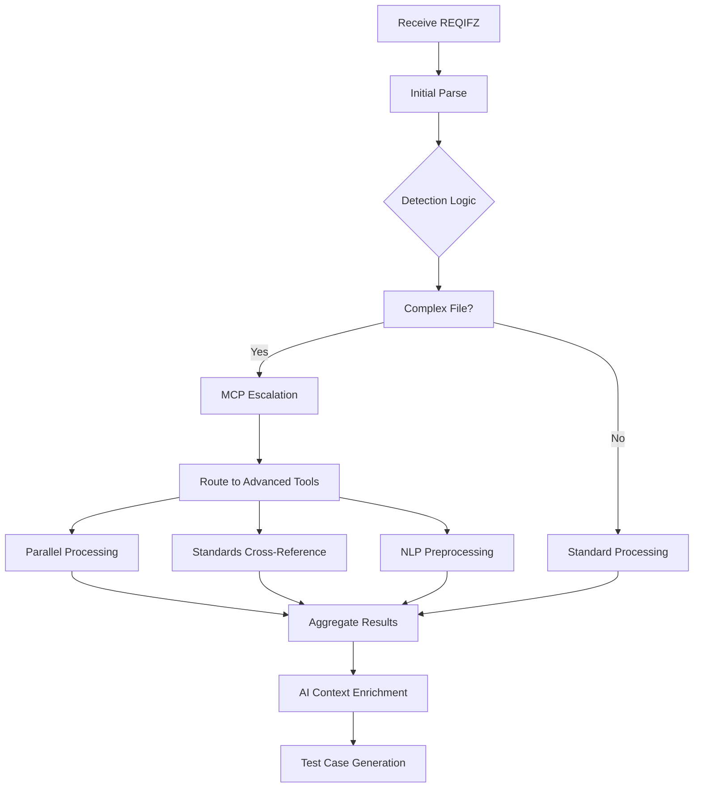

# MCP Enhancement Plan for Advanced REQIFZ Parsing

**Date:** October 2025
**Status:** Planning Phase
**Scope:** Document Processing Tools Integration

---

## Executive Summary

This document outlines an enhancement plan to integrate advanced document processing tools via MCP (Model Context Protocol) servers to significantly expand the AI Test Case Generator's capability to handle complex, real-world automotive requirements files (REQIFZ).

---

## Current REQIFZ Parsing Architecture

The project currently handles REQIFZ parsing through:

### Core Functions
- **ZIP Archive Extraction**: REQIFZ files are ZIP containers holding `.reqif` XML files
- **XML Parsing**: Uses Python's ElementTree (ET) for DOM-based and streaming parsing
- **Artifact Classification**: Extracts 6 types (Heading, Information, System Requirements, Design Info, Application Parameters, System Interfaces)
- **Context Building**: Links headings → information → requirements for AI context enrichment
- **Table Processing**: HTML table extraction using custom `HTMLTableParser`

### Performance Features
- **High-Performance Mode**: Concurrent XML processing with ThreadPoolExecutor
- **Streaming Parsing**: Memory-efficient for large files
- **Batch Processing**: Parallel artifact extraction

---

## Enhancement Opportunity

While the current system excels with "clean" standard REQIFZ files, advanced MCP integration would address significant industrial pain points:

### Target Scenarios
- **Large OEM Files**: Proprietary schemas from BMW, VW, Mercedes
- **Tier 1 Suppliers**: Specialized requirements management tools
- **Global Engineering**: Multi-language requirements
- **Legacy Files**: Non-standard or corrupted exports

---

## Advanced REQIFZ Processing Capabilities

### 1. Enhanced XML/XHTML Processing
- **XPath/XQuery Advanced Queries**: Navigate complex XML hierarchies
- **XSLT Transformations**: Convert proprietary schemas to standard formats
- **Schema Validation**: Automotive-specific dialect checking
- **Malformed XML Recovery**: Handle partial corruption in large files

### 2. Proprietary Format Support
- **Vector/Dassault Extensions**: Custom attribute processing
- **Siemens Polarion**: Specialized requirement tracking fields
- **IBM DOORS Next**: Integration with DOORS ecosystem
- **Windchill RV&S**: ALM integration artifacts

### 3. Advanced Content Extraction
- **Embedded Documents**: PDF specifications within REQIFZ archives
- **Binary Attachments**: Technical drawings, diagrams extraction
- **Multi-modal Content**: Images, CAD files, simulation models
- **Version Control Metadata**: Change tracking from source tools

### 4. NLP Preprocessing Tools
- **Terminology Extraction**: Auto-detect automotive domain vocabularies
- **Entity Recognition**: Identify ECUs, sensors, actuators, CAN signals
- **Language Translation**: Handle German/French automotive requirements
- **Requirement Relationship Mining**: Discover implicit dependencies

### 5. Standards Database Integration
- **ISO 26262 Safety Standards**: Cross-referencing compliance
- **AUTOSAR Component Models**: Architectural validation
- **MISRA C Guidelines**: Coding standard linking
- **ASIL Level Classification**: Safety integrity level analysis

### 6. Cloud Processing Services
- **Large File Handling**: Process 1GB+ REQIFZ files in cloud
- **Parallel Distributed Parsing**: Scale across multiple servers
- **Smart Caching**: Reuse parsed structures across sessions

### 7. Quality Assurance Tools
- **Markup Validation**: XHTML well-formedness checking
- **Completeness Analysis**: Missing attributes/relationship detection
- **Consistency Checking**: Requirement ID standards verification
- **Security Scanning**: Data leakage detection in exports

---

## Technical Implementation

### MCP Server Architecture

```yaml
# Proposed MCP server configuration
mcp_servers:
  document_processor:
    url: "http://localhost:3001"  # Local MCP server

    tools:
      - extract_complex_reqifz
      - validate_automotive_requirements
      - extract_embedded_diagrams
      - cross_reference_standards
      - translate_automotive_requirements

    resources:
      - automotive_standards_database
      - proprietary_schema_repository
      - terminology_knowledge_base
```

### Enhanced Workflow



### Intelligent Routing Logic

**Complexity Detection:**
```python
def detect_complexity(file_path: Path) -> dict[str, bool]:
    """
    Analyze REQIFZ file complexity to determine processing approach.

    Returns:
        Dictionary of complexity flags requiring MCP processing
    """
    flags = {
        'large_file': False,        # >500MB
        'proprietary_format': False,# Custom schemas
        'multi_language': False,    # Non-English content
        'embedded_content': False,   # PDFs/images inside ZIP
        'corrupted_xml': False,     # Parse errors detected
        'standards_refs': False     # ISO/ASIL references found
    }

    # Detection implementation...

    return flags
```

### Configuration Integration

```yaml
# config.yaml additions
mcp_processing:
  enabled: true
  fallback_to_standard: true
  complexity_thresholds:
    max_standard_file_size: 500 MB
    max_standard_artifacts: 10000
  server_endpoints:
    document_processor: http://localhost:3001
    standards_service: http://localhost:3002
```

---

## Benefits Analysis

### User Impact
- **OEM Adoption**: Support for all major automotive tooling ecosystems
- **Global Engineering**: Multi-language requirement processing
- **Enterprise Scale**: Handle real-world requirements complexity
- **Performance**: Cloud processing for massive spec files

### Technical Advantages
- **Robustness**: Handle edge cases that currently fail
- **Richness**: Extract more context for better AI generation
- **Scalability**: Distributed processing for high-volume enterprise use
- **Quality**: Standards validation and consistency checking

### Business Value
- **Market Penetration**: Compete with specialized requirement tools
- **Customer Satisfaction**: Eliminate manual preprocessing steps
- **Support Efficiency**: Reduce help tickets for parsing issues
- **Competitive Advantage**: Unique capability in AI test generation space

---

## Implementation Phases

### Phase 1: Foundation (Weeks 1-4)
- [ ] MCP server infrastructure setup
- [ ] Basic document complexity detection
- [ ] Simple XML formatting tools
- [ ] Integration testing framework

### Phase 2: Core Processing (Weeks 5-10)
- [ ] Advanced XML parsing tools
- [ ] Proprietary format support
- [ ] Embedded content extraction
- [ ] Performance benchmarking

### Phase 3: Intelligence Features (Weeks 11-16)
- [ ] NLP preprocessing integration
- [ ] Standards database connection
- [ ] Entity recognition and terminology
- [ ] Multi-language support

### Phase 4: Production (Weeks 17-20)
- [ ] Error handling and fallbacks
- [ ] Configuration management
- [ ] Documentation and training
- [ ] Production deployment

---

## Risk Assessment

### Technical Risks
- **MCP Server Availability**: Single point of failure
- **Performance Overhead**: Additional network calls
- **Compatibility Issues**: MCP server version conflicts

### Mitigation Strategies
- **Graceful Degradation**: Always fallback to standard processing
- **Caching Layer**: Avoid repeated expensive operations
- **Circuit Breaker**: Disable MCP features if issues detected
- **Progression Path**: Enhanced features can be disabled individually

### Business Risks
- **Vendor Lock-in**: Dependency on specific MCP server implementations
- **Cost Complexities**: Cloud processing expense scaling
- **Integration Overhead**: Maintaining MCP server infrastructure

---

## Success Metrics

### Technical KPIs
- **Performance**: Response time regression <5%
- **Reliability**: 99.9% success rate on supported formats
- **Capacity**: Handle files up to 2GB in cloud processing

### User Experience KPIs
- **Adoption Rate**: 80% of enterprises enable advanced features
- **Parsing Success**: Reduce failed files by 95%
- **User Satisfaction**: >4.5/5 rating for complex file handling

### Business Impact
- **Time Savings**: 75% reduction in manual preprocessing
- **Cost Efficiency**: ROI achieved within 6 months
- **Market Share**: Address previously inaccessible customer segments

---

## Conclusion

The MCP enhancement plan provides a strategic pathway to transform the AI Test Case Generator from a tool effective with standard requirements files into an enterprise-grade solution capable of handling the full complexity of industrial automotive development processes.

By intelligently detecting complex scenarios and routing them to specialized MCP-powered tools while maintaining backward compatibility, this enhancement maintains the system's current simplicity for normal use cases while providing the horsepower needed for mission-critical automotive applications.

---
