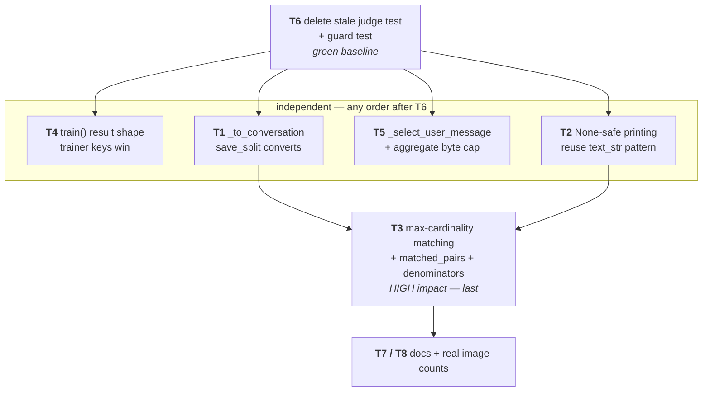

# Plan — Close the 8 findings in the 2026-07-26 training/evaluation review

**Status:** NOT STARTED — stored for later execution. No code changes have been
made against this plan.

**Goal:** Close all eight findings of the 2026-07-26 review of `src/training/`
and `utilities/`, so the `build → split → evaluate` workflow runs end to end,
evaluation printing survives a legitimate zero-quality run, `content_f1` stops
depending on output order, and the documented full test runner goes green.

**Baseline:** HEAD `d3bd074` on `claude/refine-local-plan-zef6uv`. All eight
findings were re-verified against this tree during planning.

**Source review:** `Review_Comments_2026_07_26.md` — local to the author's
machine, not committed under `docs/reviews/`. The verified-evidence table below
carries the per-finding file/line citations so this plan stands alone without it.

## Context

The training/evaluation stack was declared complete after the LLM-judge
retirement (`cfe064d` / `da5de72`, HEAD `d3bd074`). It isn't. Three user-facing
contracts are broken and one test still imports a deleted module.

I re-verified every finding directly against the working tree (the review
document itself is local-only — it is not committed under `docs/reviews/`, whose
newest entry is `Review_Comments_2026_07_24.md`). All eight reproduce. The
production REQIFZ → Excel path is untouched; every defect is in `src/training/`
and `utilities/`.

Intended outcome: the `build → split → evaluate` workflow actually runs
end-to-end, a legitimate zero-quality evaluation prints instead of crashing,
`content_f1` stops changing value when the model merely reorders its output, and
the full test runner goes green.

### Verified evidence

| # | Sev | Confirmed at |
|---|---|---|
| 1 | Critical | `save_split` (`raft_dataset_builder.py:434-437`) writes raw `question`/`oracle_context`/`answer` rows. `_validate_example_contract` (`vision_raft_trainer.py:807-812`) requires `messages`. Only `save_dataset` (`:202-251`) converts. |
| 2 | Critical | `ReferenceOverlapScorer.score` returns `precision: None` on zero generated cases (`content_scorer.py:101-104`); `print_evaluation_result` formats `metrics.get("content_precision", 0.0)` with `:.2f` (`train_vision_model.py:352-355`). `dict.get` cannot replace an existing `None` → `TypeError`. |
| 3 | Critical | `_count_matches` (`content_scorer.py:110-127`) is sequential-greedy over generated order, not max-cardinality. `ContentScore` (`:17-23`) has no pair identities. `_aggregate_eval_metrics` (`:1136-1195`) macro-means and emits no sample counts. |
| 4 | Critical | `train()` sets `result["modelfile"]` (`:192`), `stats["text_only_examples"]` (`:244`), `stats["avg_images_per_vision_example"]` (`:246`). `print_training_result` (`train_vision_model.py:269-279`) reads `modelfile_path`, `text_examples`, `avg_images_per_example`. |
| 5 | Recommended | Validator picks the first `role == "user"` (`:814-819`); `_evaluate_example` hardcodes `messages[1]` (`:921`). Per-example limits only (`:64-66`) — 5000 × 16 × 10 MiB with no aggregate cap. |
| 6 | Recommended | `tests/training/test_vision_raft_evaluate_integration.py:185,191,196` imports `src.training.llm_judge_scorer` and passes `judge_model=`. |
| 7 | Optional | `docs/training/README.md:93-95` contradicts `:71-77`. `docs/training/training_guideline.md` does not exist yet is linked from `build_vision_dataset.py:38,148,278`. |
| 8 | Optional | Builder stores `oracle_images`/`distractor_images` (`:172-175`), never `images`; `print_dataset_stats` sums `ex.get("images", [])` (`build_vision_dataset.py:175`) → always 0. |

### Three corrections to the draft plan

These are the substantive changes; everything else in the draft held up.

1. **Task 1 breaks two existing tests as drafted.** The `_examples(n)` fixture
   at `tests/training/test_raft_dataset_builder.py:336-337` already returns
   *conversation-shaped* rows (`{"messages": [...]}`). Converting inside
   `save_split` makes `_to_conversation` raise `KeyError: 'oracle_context'` in
   `test_save_split_writes_two_jsonl_files` (`:360`) and
   `test_save_split_refuses_overwrite_without_force` (`:368`). The fixture must
   be changed to emit intermediate RAFT rows. Related: all four split tests
   construct the builder via `RAFTDatasetBuilder.__new__(RAFTDatasetBuilder)`
   with no `__init__`, so **`_to_conversation` must be a `@staticmethod`** that
   touches no `self` state (no `self.logger`, no `self.output_dir`).

2. **Task 6's guard test has live collateral the draft didn't account for.**
   `tests/training/test_train_vision_cli.py:347` — `test_print_omits_content_quality_when_absent`
   — is a maintained test asserting a *retired* metric isn't printed. A repo-wide
   `content_quality` ban fails on it immediately. Delete that test as part of the
   retirement (it guards nothing: `content_quality` no longer exists anywhere in
   `src/`). `CHANGELOG.md` must also be excluded from the guard — it legitimately
   records the retirement.

3. **The `"llm"` scorer kind is not dead code.** `run_calibration(scorer, "llm", …)`
   is exercised ~10× in `tests/training/test_judge_calibration.py` as a generic
   *second scorer kind* — `scorer_kind` is a free string, and the per-kind band
   mechanism is the point. Task 7 should reword the `judge_calibration.py:8-10`
   docstring to say bands are keyed by an arbitrary scorer-kind string, and must
   **not** touch those tests or add `judge` to the Task 6 guard's banned list.

### Environment note

Dev dependencies are **not installed** in this container (`import pydantic` →
`ModuleNotFoundError`), so `pytest tests/` cannot collect. `ruff` and `mypy` are
on PATH. There is no Ollama here either. Run `pip install -e .[dev]` before the
test steps; the live-integration and end-to-end steps require the user's local
machine.

### GitNexus impact (per CLAUDE.md, run before editing)

- `_aggregate_eval_metrics` — **HIGH**: 4 upstream, 3 flows (`run_evaluation`,
  `_score_over_dataset`, `_compare_paired`), 2 modules. **Additive keys only** —
  `_compute_delta` (`:722-743`) iterates a fixed `comparable` tuple, so new keys
  are ignored there by construction. Do not rename or retype existing keys.
- `save_split` — **LOW**: one direct caller, `build_vision_dataset.main`
  (`:255-262`).
- `ContentScore` — 2 exact-dict assertions must move (see Task 3).

---

## Dependency shape



```
BEFORE                                    AFTER
build_vision_dataset --val-split-ratio    build_vision_dataset --val-split-ratio
  save_dataset  -> [messages] .jsonl  OK    save_dataset  -> _to_conversation -> [messages]
  save_split    -> {question,...}     XX    save_split    -> _to_conversation -> [messages]
                        |                                         |
                        v                                         v
  train_vision_model --evaluate val.jsonl   train_vision_model --evaluate val.jsonl
  _validate_example_contract -> ValueError  _validate_example_contract -> OK
```

---

## Work

Order: **6 → 4 → 2 → 1 → 5 → 3 → 7 → 8.** T6 first so every later change is
measured against a green baseline; T3 last among code changes because it carries
the widest blast radius and builds on T1/T2.

### T6 — finish the judge retirement

- Delete `test_real_ollama_llm_judge_populates_quality`
  (`tests/training/test_vision_raft_evaluate_integration.py:178-205`). The three
  sibling live evaluator cases in that file cover the active overlap path;
  nothing replaces it.
- Delete `test_print_omits_content_quality_when_absent`
  (`tests/training/test_train_vision_cli.py:347-358`) — see correction 2.
- Add a guard test (suggested: `tests/training/test_judge_retirement_guard.py`)
  walking `src/`, `utilities/`, `tests/`, `main.py` and `docs/training/*.md`,
  asserting no file matches `llm_judge_scorer`, `LLMJudgeScorer`, `judge_model`,
  `--content-scorer`, or `content_quality`.
  **Exclusions, all deliberate:** `CHANGELOG.md`, `docs/superpowers/**`,
  `docs/reviews/**`, `docs/training/archive/**`, `graphify-out/**`,
  `.gitnexus/**`. Do **not** ban the bare token `judge` — `judge_calibration*`
  and `--validate-judge` are live.

### T4 — one result shape

`src/training/vision_raft_trainer.py` — declare the shapes once as TypedDicts
(`TrainResult`, `DatasetStats`) next to the existing `type TrainingResult = dict[str, Any]`
alias (`:39`) and annotate `train()` / `_analyze_dataset()` with them.

`utilities/train_vision_model.py:269-279` — fix the reads to the trainer's actual
keys: `result["modelfile"]`, `stats["text_only_examples"]`,
`stats["avg_images_per_vision_example"]`. Precise failure today: `modelfile_path`
goes through `.get(…, "N/A")` and silently misreports; `stats['text_examples']`
is a direct index and raises `KeyError`, which `main()` (`:589-594`) swallows
into `return 1` **after `ollama create` already succeeded**.

**Test** (`tests/training/test_train_vision_cli.py`): push a realistic `train()`
success result through `print_training_result`, and through `main()` with the
trainer patched, asserting exit 0 and that the modelfile path appears in the log.

### T2 — None-safe evaluation printing

`utilities/train_vision_model.py` — the module already has the pattern at
`:317-320` (`text_str` / `vision_str`). Lift it into a small local helper
(alongside the existing `_format_delta` at `:304-306`) and apply it to
`content_precision` and `content_recall` at `:352-355`. `content_f1` is already
guarded by the `is not None` check at `:347`.

**Test**: drive `print_evaluation_result` with
`content_f1: 0.0, content_precision: None, content_recall: 0.0` and assert no
raise; add a `run_evaluation` case asserting a zero-quality run exits non-zero
via the existing rule at `:469` (`total == 0 or failed >= total or baseline_unusable`),
not via `TypeError`.

### T1 — one shared intermediate → conversation converter

`src/training/raft_dataset_builder.py`

- Extract the per-example body of `save_dataset` (`:202-251`) into
  **`@staticmethod _to_conversation(example: dict) -> dict`** returning the
  `{"messages": [system, user, assistant], "metadata": …}` envelope. Move the
  context-string assembly, the `oracle_images` → `user_message["images"]` base64
  mapping, and the system prompt **verbatim** — `save_dataset` becomes a map over
  it with zero behaviour change. Static, per correction 1.
- `save_split` (`:434-437`) applies `_to_conversation` to each row before
  `json.dumps`. Partition on the *intermediate* examples first (`split_dataset`
  unchanged, so the determinism tests at `:340-351` keep passing), convert on
  write.

`utilities/build_vision_dataset.py:255-262` needs no change.

**Tests** (`tests/training/test_raft_dataset_builder.py`)

- Update `_examples` (`:336-337`) to emit intermediate RAFT rows —
  `question`, `oracle_context`, `distractor_context`, `answer`, `metadata`,
  `has_images: False` — matching `_build_raft_example`'s return (`:168-183`).
  Required, per correction 1.
- New cross-component test: `save_split` into `tmp_path`, then feed the written
  `val.jsonl` through `VisionRAFTTrainer._load_and_validate_examples()` and
  assert it loads. This is the assertion the review flags as missing — the
  existing `test_save_split_writes_two_jsonl_files` stops at line counts.

### T5 — validated message == evaluated message, + aggregate bound

`src/training/vision_raft_trainer.py`

- Extract `_select_user_message(messages) -> dict | None` holding the validator's
  current logic (first `role == "user"`, falling back to `messages[1]` when it's
  a dict). Call it from both `_validate_example_contract` (`:814-819`) and
  `_evaluate_example` (`:921`). Today a `[system, assistant, user]` dataset
  validates the user turn but *generates from the assistant reference* — the
  model is fed its own answer.
- Add `max_eval_total_bytes: int` to `VisionTrainingConfig` beside
  `max_image_bytes` (`:66`). Suggested default 2 GiB. Thread a running total
  through `_validate_images` / `_validate_example_contract` (accumulate the
  already-computed `approx_decoded_bytes`, `:857`) and raise on breach in
  `_load_and_validate_examples`. Closes the ~800 GiB envelope the per-example
  limits permit. Note `VisionTrainingConfig` is `@dataclass(slots=True)` — the
  field declaration is the slot.

**Scope note (unchanged from draft):** adding the aggregate cap but **not**
converting `_load_and_validate_examples` to a generator. Full streaming means
reshaping `_score_over_dataset` (`:676`) and `_compare_paired` (`:628`), both of
which index the materialized list positionally (`zip(…, strict=True)`), and is
disproportionate to closing the memory hole. Flagged for separate scheduling.

**Tests**: reordered roles, extra roles, duplicate user turns, aggregate-size
rejection, plus a regression asserting the prompt generated-from equals the
message validated for `[system, assistant, user]`.

### T3 — defensible content metric

`src/training/content_scorer.py`

- Replace `_count_matches` (`:110-127`) with **max-cardinality bipartite
  matching** — Kuhn's augmenting-path over the ≥-threshold graph, ~30 lines, no
  scipy (this project stays dependency-light and fully local). Iterate candidate
  references in index order so the chosen matching is stable run to run.
  Cardinality is what both precision and recall divide into, so maximizing it
  fixes both at once.
- Add `matched_pairs: list[tuple[int, int]]` to `ContentScore`, as
  `(generated_index, reference_index)` sorted by generated index. This closes the
  ceiling CLAUDE.md records — a scorer pairing the right *count* of wrong items
  is now distinguishable. Return `[]` on the empty-generated branch (`:101-104`).
- Update the class docstring (`:64-71`), which currently documents the greedy
  rule as intentional.

⚠️ **`ContentScore` blast radius** — CLAUDE.md records this breaking twice.
The two exact-dict assertions are `tests/training/test_content_scorer.py:33`
(`test_perfect_overlap_scores_one`) and `:76`
(`test_no_generated_gives_zero_recall_none_precision`); switch both to per-key
assertions. `judge_calibration._check_metrics` (`:82-98`) iterates declared
*bands*, not score keys, so the six calibration fixtures are structurally
unaffected — confirm with `--validate-judge` (expect 6/6).

`src/training/vision_raft_trainer.py`

- `_score_content` (`:1110-1134`) currently collapses "no reference",
  "unparseable reference" and "scorer raised" into a single `None`. Return `None`
  only for a genuinely absent reference (`_reference_answer` → None); record
  parse/scorer faults on the per-example row so they can be counted.
- `_aggregate_eval_metrics` (`:1136-1195`) — **additive keys only**:
  `content_reference_examples`, `content_scored_examples`,
  `content_scoring_errors`. The existing comment at `:1167-1174` documenting the
  intentional precision/recall denominator asymmetry stays and should be
  extended to name the new fields. Print them under the Content F1 block in
  `print_evaluation_result`.
- `_compare_paired` (`:628-671`): when the paired *content* sample is incomplete,
  mark the content delta partial or withhold it, mirroring the withheld-delta
  convention established by the 2026-07-24 review's Critical 1 (already
  implemented for the overall delta at `:658-663`).

**Tests** (`tests/training/test_content_scorer.py`)

- Permutation regression — the review's matrix (gen1/ref1 0.90, gen1/ref2 0.90,
  gen2/ref1 1.00, gen2/ref2 0.80 at threshold 0.85) must yield the same F1 for
  generated order `[1,2]` and `[2,1]` (today: 0.50 vs 1.00). Permute references
  too.
- Assert `matched_pairs` **identities** only on fixtures with a *unique* optimal
  matching — max-cardinality is cardinality-invariant under permutation, not
  pair-set-invariant, so identity assertions on ambiguous fixtures would be
  flaky. On ambiguous ones assert `len(matched_pairs)` and that indices are
  distinct on both sides.
- Assert the three new denominator fields on a one-parseable /
  one-unparseable-reference pair.

### T7 — documentation contracts

- `docs/training/README.md:93-95` — delete "Requires an **explicit** held-out
  file — no train/val split is produced, so there is no honest default";
  `:71-77` documents the split and is now true.
- `utilities/build_vision_dataset.py:38,148,278` — repoint the three
  `docs/training/training_guideline.md` links to `docs/training/README.md`.
  (`docs/training/archive/**` references stay — that directory is archival.)
- `utilities/train_vision_model.py:4-6` — drop "RAFT-informed"; the system prompt
  is fixed, as `:280-284` of the README already states.
- `src/training/vision_raft_trainer.py:15-18` — "It measures output validity, not
  closeness to the reference answer" is now false; `_score_content` does exactly
  that. Reword to name both signals.
- `src/training/judge_calibration.py:8-10` — reword to an arbitrary scorer-kind
  string; see correction 3. **Do not touch the `"llm"` usages in
  `tests/training/test_judge_calibration.py`.**

### T8 — real image counts in the build summary

`utilities/build_vision_dataset.py:175` — sum
`ex.get("metadata", {}).get("image_count", 0)`, already populated by
`_build_raft_example` (`raft_dataset_builder.py:180`), instead of the nonexistent
`ex["images"]`. This mirrors what `save_dataset` already does correctly at
`:257`. Add a vision example to the utility test and assert the count is
non-zero.

---

## Constraints

- **No cloud models anywhere**, including evaluation. Hard rule.
- `ContentScorer` / `ContentScore` is a documented seam — additive change only.
- `--validate-judge` runs no generation model; keep it that way.
- Calibration bands are tolerances. If a band breaches after the matching change,
  **fix the scorer or report it — do not widen the band.**
- `__slots__` on core classes and `slots=True` dataclasses: every new attribute
  needs its declaration.
- Touch formatting/typing only on files actually edited — the repo carries
  pre-existing `ruff format` drift (~11 files) and ~310 mypy errors.
- Update `CHANGELOG.md` (Added/Changed/Fixed) per CLAUDE.md.

## Verification

```bash
pip install -e .[dev]                          # NOT installed in this container

# 1. Gate
ruff check src/ main.py utilities/ --fix
ruff format src/training/ utilities/ tests/training/   # edited files only
mypy src/training/ utilities/ --python-version 3.14

# 2. Focused, then full
python3 -m pytest tests/training/ -v
python3 tests/run_tests.py                     # target 0 failed (baseline: 1 failed)

# 3. Scorer in isolation — expect 6/6, no Ollama
python3 utilities/train_vision_model.py --validate-judge
```

Requires the user's local machine (Ollama + `llama3.1:8b` / `llama3.2-vision:11b`;
neither Ollama nor the models exist in this container):

```bash
# 4. The workflow finding 1 broke, end to end
python3 utilities/build_vision_dataset.py --val-split-ratio 0.2 --split-seed 42
python3 utilities/train_vision_model.py \
    --evaluate training_data/raft_dataset/val.jsonl --output-model llama3.1:8b
#    must load val.jsonl and print a content block without TypeError

# 5. Live paths — -rs so a silent skip can't pass for a pass
python3 -m pytest tests/ -m integration -rs

# 6. Production path untouched
python3 utilities/create_mock_reqifz.py && ai-tc-generator input/<mock>.reqifz --verbose
```

Pre-commit: `node .gitnexus/run.cjs analyze && graphify update .`, then
`detect_changes({scope: "compare", base_ref: "main"})` — confirm the affected set
is the training/evaluation surface only.

Commit per `commit.md`: conventional messages, explicit `git add <file>` (never
`git add .`), split into isolated commits — one per task grouping. Push to
`claude/refine-local-plan-zef6uv` with `git push -u origin`.

## Out of scope

- Streaming rewrite of `_load_and_validate_examples` (see T5 note).
- Reinstating any LLM-as-judge scorer. `matched_pairs` is the prerequisite for
  re-evaluating that question, not the reinstatement.
- The ~310 pre-existing mypy errors and the ~11 files with `ruff format` drift.
- `docs/superpowers/**`, `docs/reviews/**`, `docs/training/archive/**`, and
  `CHANGELOG.md` history — all historical records, left as written.
